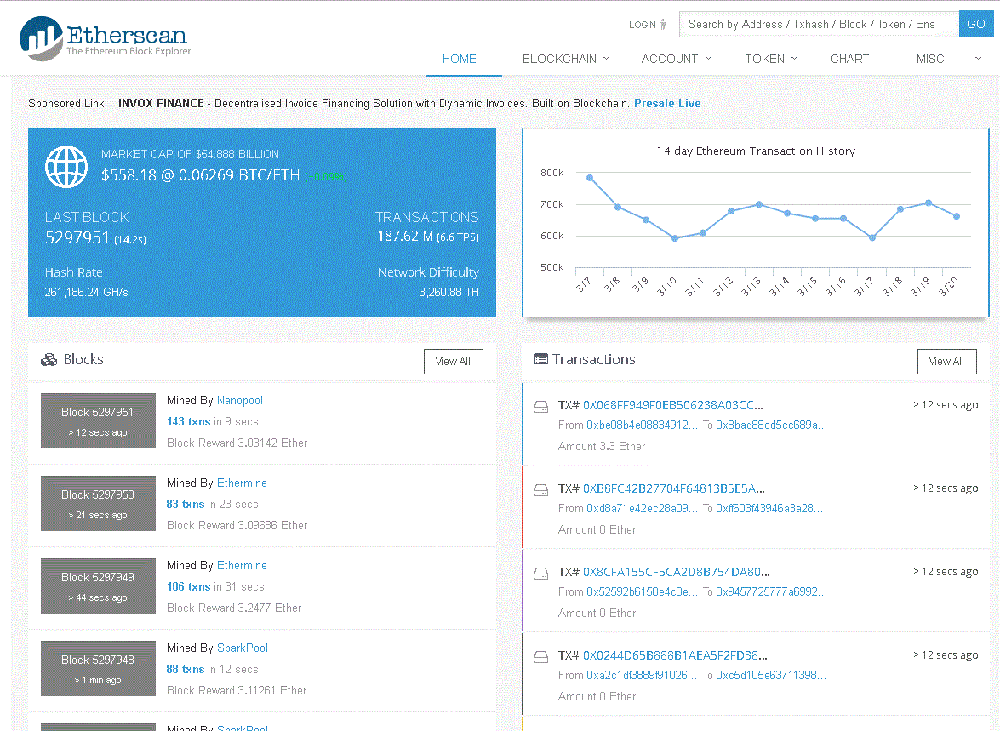
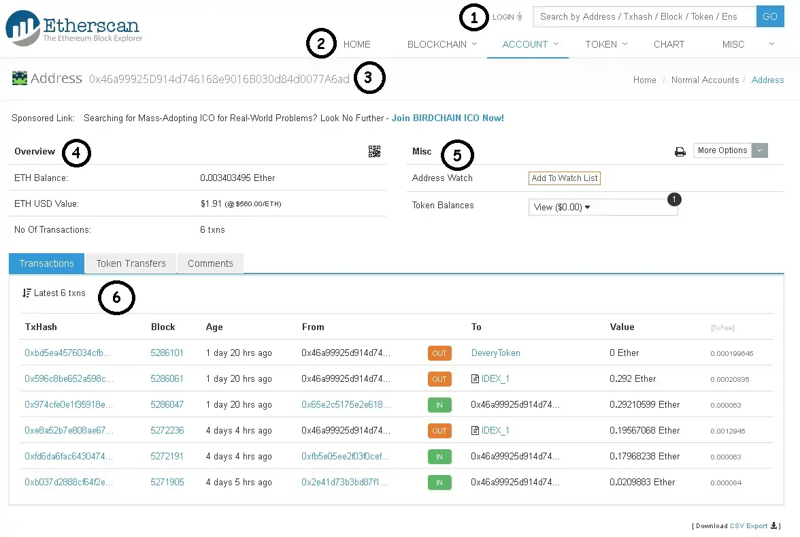
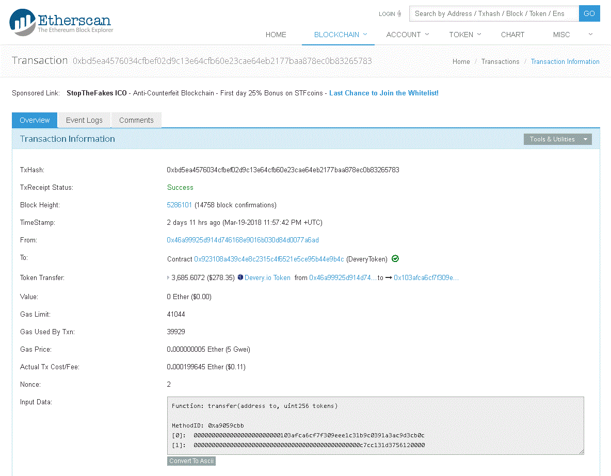

# Etherscan

    Site web permettant de suivre l'état d'avancement des transactions Ethereum.

---

## Suivres ses transactions sur la blockchain avec Etherscan

Etherscan est un **BlockExplorer** pour ***Etherum***. Un BlocExplorer est **un moteur de recherche** qui permet à ses utilisateurs de chercher facilement des transactions qui transite sur la blockchain Ethereum.

Etherscan n'est pas financé, exploité ou gérer par la ***Fondation Ethereum***, mais existe en tant qu'entité indépendante. La blockchainEtherum dispose d'un grand livre public (comme une base de données **décentralisée**, regroupant toutes **les transactions** effectuées sur la blockchain Etherum) qu'Etherscan.io indexe et met ensuite à disposition de tous. Leur mission est de << *faciliter la transparence de la blockchain en indexant et en rendant toutes les transactions consultables sur  Ethreum Blockchain de la manière la plus transparente et facie possible* >>

Etherscan n'est pas un fournisseur de **wallet** (portefeuille), aucun stockage de clés privées n'y est effectuer et ils n'ont aucun contrôle sur les transactions qui se déroule sur le réseaux Etherum.

Etherscan propose aussi un ensemble de service comme des API permettant de créer des **applications**, un **système de vérification de smart contract** et de **signatures** ainsi que de l'aide au calcul pour le **mining**.

---

## Utilisation d'Etherscan

- [lien vers Etherscan](https://etherscan.io/){ target="_blank" }

Voici un aperçu de la page d'accueil d'Etherscan :

- **A gauche**, dans l'onglet bleu, est indiqué **le market cap** d'etherum.
- **A droite** du market cap est indique le **nombre de transactions** effectuées sur la blockchain Etherum au cours des 14 derniers jours.
- **En bas à gauche**, les derniers blocs **ETH minés** et les pools correspondantes.
- **En bas à droite**, les **dernières transactions effectuées** sur la blockchain Etherum.

Pour consulter un portefeuille, vous devez indiquer la **clé publique** (l'adresse corespondante) dans la barre de recherche situé en haut à droite. Voici un hash de transaction (TxHash) :

- `0xbd5ea4576034cfbef02d9c13e64cfb60e23cae64eb2177baa878ec0b83265783`

Une fois l'adresse indiqué, vous arrivez sur une page similaire à celle de ci-dessous :

Nous allons expliquer en détail les différents parties :

1. La barre de recherche où vous devrez indiquer une **adresse publique** de portefeuille Etherum, un **Hash** de transaction (numéro de transaction), un **Block**, un **Token**...
2. Le menu Etherscan qui vous permet de **revenir sir la page d'accueil (Home), d'accéder aux transactions, blocs, données de smart contract (Blockchain)**. Vous pouvez également accéder à tous les contrats et les adresse Etherum (**Account**). La partie **Token** permet de visualiser des tokens et leurs transferts. La parties **Chart** fournie des informations intéressantes tels que **les frais de transactions, le nombre de transactions**... Pour finir, Misc permet d'accéder à de nombreuse fonctionnalités comme des APIs, des calculateurs de minage...
3. Cela correspond à l'adresse que vous êtes actuellement en train de consulter.
4. **Overview** est un résumé de l'adresse, le nombre d'Ether contenu (**ETH Balance**), leur valeur en dollars (**ETH USD Value**) et le nombre de transactions(**No Of Transaction**).
5. **Misc** vous permet d'ajouter cette adresse à votre liste (vous devez disposer d'un compte Etherscan), ce qui permet de regrouper toutes ses adresses sur un même compte. Il permet également de voir la valeur des tokens que vous stockez sur votre adresse lorsque vous cliquez dessus (**Token Balances**).
6. Cete partie correspond au tableau regroupant les dernières transactions Etherum (**Transactions**), les transferts de tokens (**Token Transfers**) et les commentaires (**Comments**).

Voici les différentes composantes du tableau (**partie 6**) :

- ***TxHash***: le hash de la transaction, cela correspond a un numéro de transaction.
- ***Block***: le bloc Etherum sur lequel la transaction est enregistrée.
- ***Age***: le nombre de jours et d'heures depuis que la transaction a été effectué.
- ***From***: l'adresse qui émet la transaction.
- ***To***: l'adresse qui reçoit la transaction.
- ***Value***: la valeur correspondante à la transaction en Ether.
- ***[TxFee]***: les frais de transaction associés.

---

## Suivre une transaction Etherum

Pour suivre une transaction sur la blockchain Etherum vous devrez avoir :

- Soit l'**adresse émettrice**.
- Soit l'**adresse de réception**.
- Soit le **TxHash** (numéro de transaction).

Après avoir renseigné le TxHash donné précédemment dans **la barre de recherche** vous serez redirigé sur la page suivante :

Nous allons voir ensemble les différentes informations contenues dans l'onglet **Overview** :

- ***Txhash***: Le Hash de la transaction, c'est à dire le numério de la transaction.
- ***TxReceipt Status***: le staturt de la transaction. **Success** signifie que la transaction s'est terminé avec succès.
- ***Block Height***: le numéro de bloc contenant la transaction ainsi que le nombre de transactions contenues dans ce bloc (**block confirmations**).
- ***TimeStamp***: indique depuis combien de temps la transaction est enregistrée et la date de celle-ci.
- ***From***: l'adresse émettrice.
- ***To***: l'adresse qui reçoit la transaction.
- ***Token Transfer***: indique par quel smart contract les tokens ont transités (dans notre exemple, le smart contrat est celui de **Devery**, il est indiqué la valeur des tokens au moment où la transaction est effectuée).
- ***Value***: la valeur en Ether.
- ***Gas Limit***: le nombre de GAZ maximum que vous étiez prêt à payer.
- ***Gas Used By Txn***: le nombre de GAS que vous avez réelement utilisé.
- ***Gas Price***: le prix du GAS en Ether.
- ***Actual Tx Cost/Fee***: le coût de la transaction en dollars.
- ***Nonce***: un système dont le rôle est de rendre impossible les *replay attacks*.

---

> Lien vers source: [cryptoast](https://cryptoast.fr/tutoriel-etherscan/)

---

> Date de création: 30.06.2026
> Mise à jour: 30.06.2026
